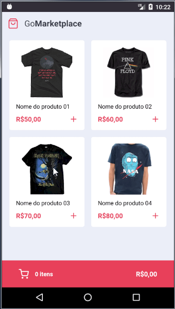

<h3  align="center">

Desafio 08: Fundamentos do React Native

</h3>


<p  align="center">“Não existe linha de chegada, a vitória está em se manter correndo”!</blockquote>


<p  align="center">


<a  href="https://rocketseat.com.br">


</a>


<a  href="https://github.com/Rocketseat/bootcamp-gostack-desafios/stargazers">


</a>

</p>


<p  align="center">

<a  href="#rocket-sobre-o-desafio">Sobre o desafio</a>&nbsp;&nbsp;&nbsp;|&nbsp;&nbsp;&nbsp;

<a  href="#calendar-entrega">Entrega</a>&nbsp;&nbsp;&nbsp;|&nbsp;&nbsp;&nbsp;

<a  href="#memo-licença">Licença</a>

</p>


<p  align="center">



</p>


### Como Executar


1. Faça o clone do projeto na sua máquina;

2. Na raiz do projeto, execute o comando `yarn` para baixar as dependências;

3. Execute `yarn test` para rodar os testes;

4. Abra o emulador ou dispositivo.

5. Execute `yarn android` compilar o projeto para dispositivo ou emulador Android ou;

6. Execute `yarn ios` compilar o projeto para dispositivo ou emulador IOS;

7. Execute `yarn json-server server.json -p 3333` para executar a Fake api de dados;

8. Execute `yarn start` para executar o projeto quando já compilado;


### Utilizando uma fake API


Antes de tudo, para que você tenha os dados para exibir em tela, criamos um arquivo que você poderá utilizar como fake API para te prover esses dados.


Para isso, deixamos instalado no seu package.json uma dependência chamada `json-server`, e um arquivo chamado `server.json` que contém os dados para uma rota `/products`. Para executar esse servidor você pode executar o seguinte comando:


```js

yarn json-server server.json -p 3333

```


## :memo: Licença


Esse projeto está sob a licença MIT. Veja o arquivo [LICENSE](LICENSE) para mais detalhes.


---


Feito por Caio Fernando
